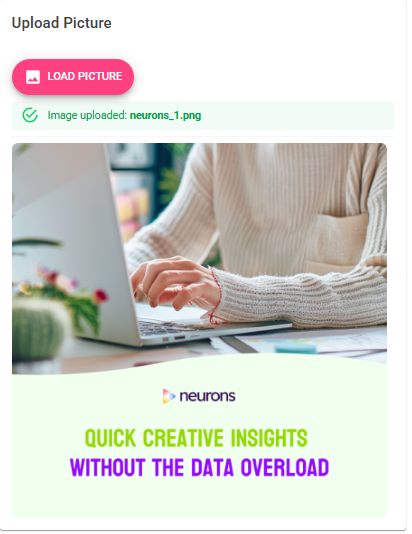
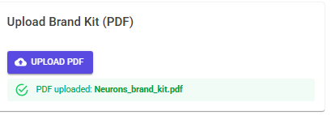
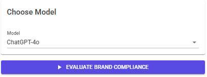
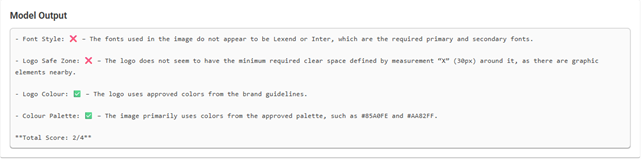

# Case study @ Neurons

## Table of Contents
- [Project Structure & Documentation](#project-structure--brief-descriptiondocumentation)
  - [Neurons (The API)](#neurons-the-api)
    - [Project Files](#project-files)
  - [Neurons_Blazor (Blazor Web Application)](#neurons_blazor-blazor-web-application)
- [Running the Project](#running-the-project)
  - [Using Docker (recommended)](#using-docker-recommended)
  - [Development mode](#development-mode)
    - [Backend (FastAPI)](#backend-fastapi)
    - [Frontend (Blazor)](#frontend-blazor)
- [Usage Example](#usage-example)
- [Testing](#testing)
- [Configure secrets](#configure-secrets)


## Neurons (The API)

### Project Files
- **extract_pdf.py**  
  Provides helper functions for extracting brand compliance information from PDF files using PyMuPDF (`fitz`).  
  Extracts: font styles, logo safe zone, logo colours, and full colour palette.

- **image_evaluation_gpt.py & image_evaluation_Qwen.py** 
  Logic regarding calling the multi-modal models GPT-4o and Qwen, respectively.

- **compliance_prompt_gpt.py & compliance_prompt_Qwen.py**  
  Builds the prompt given to the GPT-4o and Qwen model, based on extracted brand compliance from a given PDF.

- **main.py**  
  Defines the FastAPI backend. Exposes endpoints for:
  - Extracting brand compliance info from PDFs
  - Building structured compliance prompts
  - Evaluating brand compliance of images using an LLM

## Neurons_Blazor (Blazor Web Application)
The most important part of the code is the **image_evaluation.razor**. This is a Blazor front-end page that provides a user interface for testing brand compliance evaluation. It connects directly to the FastAPI backend and allows users to upload assets, choose a model, and view evaluation results.

**Main Features**
- **Upload controls** (left column):
  - Upload an **image** (preview is displayed).
  - Upload a **brand kit PDF** (validated on upload).
  - Select a **model** (default: `ChatGPT-4o`, others selectable (NOTE: If they are implemented in the backend, i.e., the API)).
  - Start evaluation with an **Evaluate Brand Compliance** button.
- **Evaluation output** (right column):
  - Shows progress with a loading spinner while the API is called.
  - Displays either an instructional message (before evaluation) or the **model’s output** (after evaluation).
  - Handles and displays errors if something goes wrong.

**Implementation details**
- Built with **MudBlazor** components for a modern UI (cards, alerts, file uploads, buttons).
- Uses **`HttpClientFactory`** to call the FastAPI backend (`/evaluate_brand_compliance_wAPI`).
- Sends both the uploaded **image** and **brand kit PDF** as multipart form data, along with the selected model name.
- Uses **state flags** (`imageOk`, `pdfOk`, `isLoading`, `BothOk`) to enable/disable UI actions and provide user feedback.
- Responses from the backend are deserialized into an `ImageEvaluationResponse` model and displayed in the UI.

**User Flow**
1. Upload an image → see preview.
2. Upload a brand kit (PDF).
3. Select a model.
4. Click *Evaluate Brand Compliance*.
5. See evaluation result (or errors) in the results panel.

## Running the Project

### Using Docker (recommended)
This project uses **Docker Compose** for setup and deployment.

1. Make sure you have **Docker** and **Docker Compose** installed.
2. Clone the repository and navigate to the project root (where `docker-compose.yml` is located).
3. Build and start the containers:

   ```bash
   docker compose up --build

### Development mode

#### Backend (FastAPI):

1. Create and activate a Python environment
2. Install dependencies (from requirements.txt):
   ```bash
   pip install -r requirements.txt
4. Run the FastAPI app with Uvicorn:
   ```bash
   uvicorn app.api:app --reload --host 0.0.0.0 --port 8000
5. The backend should be available at: http://localhost:8000

#### Frontend (Blazor):

1. Navigate to the Blazor project folder (most likely *Neuron_Blazor/*).
2. Restore dependencies and run:
   ```bash
   dotnet run
3. The frontend should be available at: http://localhost:5000

## Usage Example

Here’s how a user interacts with the system step by step:

1. **Upload an Image**  
   The user uploads the picture they want to check for brand compliance.  

   

2. **Upload the Brand Compliance PDF**  
   The brand kit (guidelines in PDF format) is uploaded for requirements.  

   

3. **Choose a Model**  
   The user selects which model should perform the evaluation (currently, only `ChatGPT-4o` is available).  

   

4. **View Model Output**  
   The system evaluates the image against the brand guidelines and displays the compliance results.  

   


## Testing
Unit testing is somewhat limited, and currently only tests the extraction of brand compliance requirements from a PDF.

1. Running the tests:
   ```bash
   pytest -q -W ignore::DeprecationWarning

### Configure secrets
Copy the example file and insert your own values (i.e., API key):
```bash
cp Neurons/.env.example Neurons/.env

